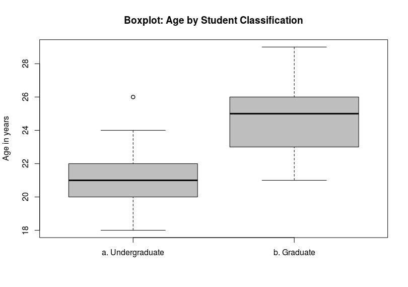
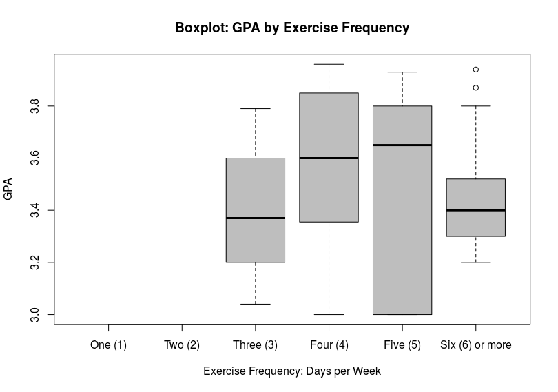
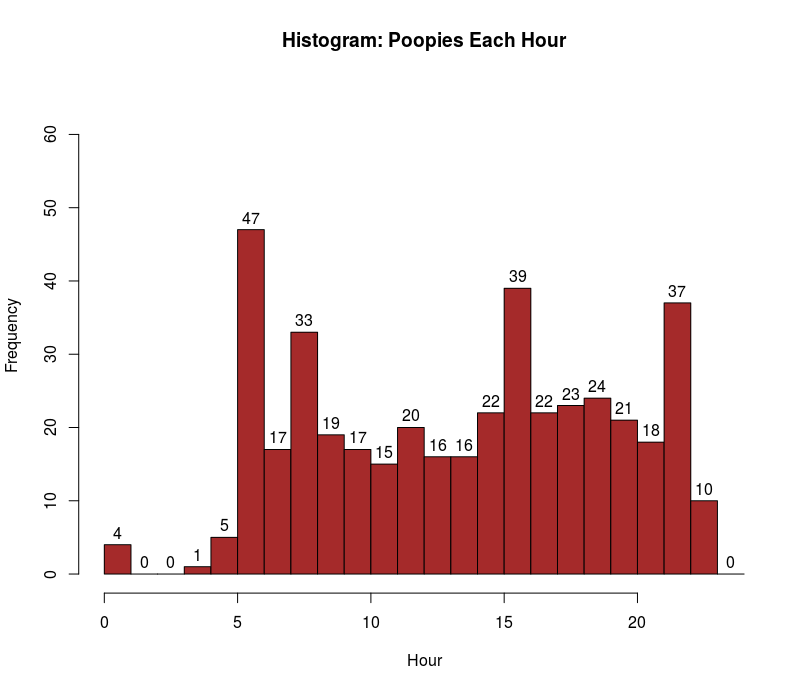

## Cancer Research

- [Data analysis portfolio](https://github.com/UACC-renedherrera)

## Data Visualization

- [Dashboard examples](https://rpubs.com/UAZCC_Rene)

## Mapping and GIS

- [Mapping with arcGIS](https://www.arcgis.com/home/item.html?id=c1d23697ede24d03b5807049597dc186)

## Other stuff:

Visit my page on GitHub to see more of my data analysis projects.

[Rene Herrera on GitHub](https://github.com/renedarioherrera)

### Graphs and Figures from my Thesis research

For my thesis research, I investigated motivations and barriers to exercise for students at campus recreation. You can read the entire thesis [here](https://scholarcommons.usf.edu/etd/7519/).

These are a few of the more interesting graphs, facts, and figures resulting from that project.

In this boxplot comparing the age of undergraduate and graduate students we can clearly see, graduate students tend to be older than undergraduate students.

In this boxplot, see how it would appear the ideal frequency for exercise to maximize GPA would be four times per week but keep in mind the sample is very small and the relationship between exercise frequency and GPA is not directly causal. That is, in this group of university students it appears those who exercise between four and five times each week are best able to keep up with their academic responsibilities because they prioritize both exercise and academics.

### Graphs and Figures from Life

After we adopted our dog in December we started tracking the time of day he would go out for a poop. After several weeks and months we were able to plot it and see which time of day he was most likely to poop (6AM, 8AM, 4PM, and 10PM). We then used that to help us schedule his time outside and minimize indoor accidents.
